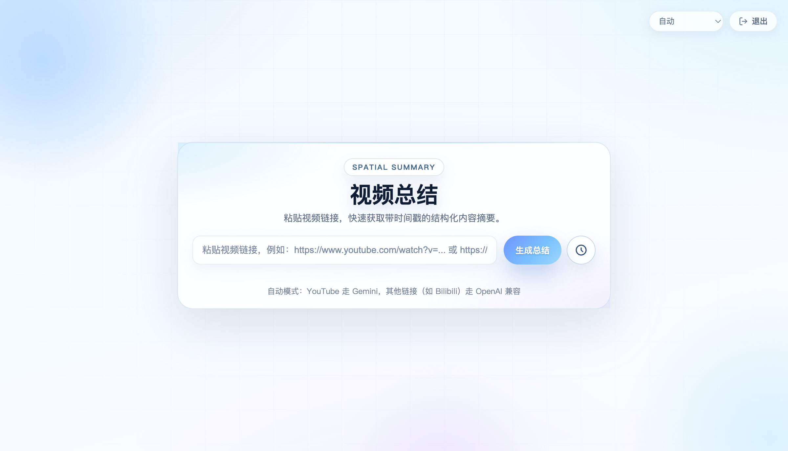
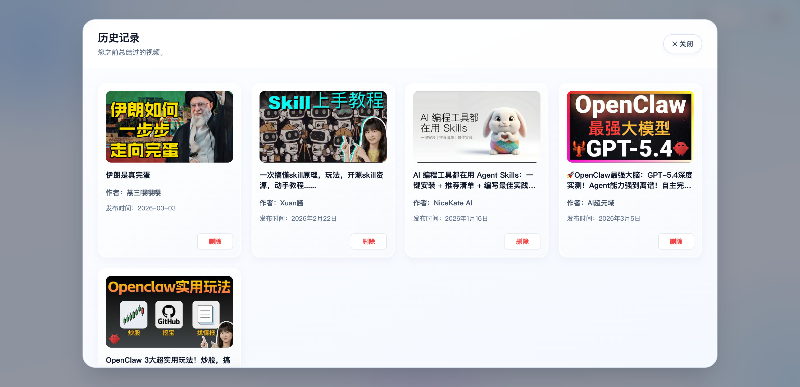
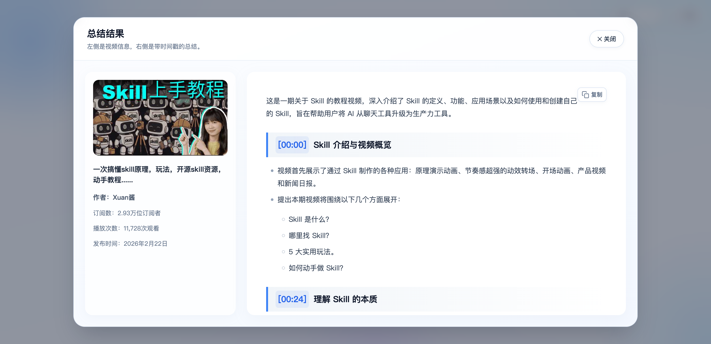
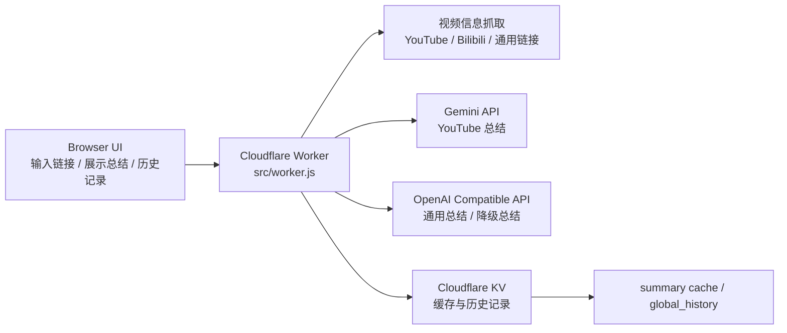

<p align="center">
  
</p>

<div align="center">


# Video Summary

**基于 Cloudflare Workers 的在线视频结构化总结工具**

[](https://workers.cloudflare.com/) [](#-模型选择规则)

输入 `YouTube`、`Bilibili` 或其他可访问的视频链接，自动提取视频信息，
生成带时间戳的中文结构化总结，并支持历史记录、KV 缓存、图片代理和可选密码访问控制。

<p>
  <a href="#-界面预览">界面预览</a> ·
  <a href="#-核心亮点">核心亮点</a> ·
  <a href="#-一键部署">一键部署</a> ·
  <a href="#-快速开始">快速开始</a> ·
  <a href="#-模型选择规则">模型选择规则</a> ·
  <a href="#-faq">FAQ</a>
</p>

<p>
  <a href="https://dash.cloudflare.com/?to=/:account/workers-and-pages/create">
    
  </a>
  <a href="#-快速开始">
    
  </a>
</p>

</div>

> [!TIP]
> `auto` 模式下，YouTube 链接优先使用 Gemini；如果 `GEMINI_API_KEY`、`GEMINI_MODEL` 中任意一个未配置，且 OpenAI 兼容配置完整，会自动降级到 OpenAI 兼容接口继续总结。`GEMINI_BASE_URL` 为可选项，不配置时默认使用 Gemini 官方地址。

---

## 🌐 在线体验

[](https://summary.661388.xyz/)

## 📸 界面预览

### 🏠 首页

<p align="center">
  
</p>

<p align="center"><sub>输入视频链接、选择模型、查看状态提示的主界面。</sub></p>

### 🗂️ 历史记录界面

<p align="center">
  
</p>

<p align="center"><sub>查看最近总结过的视频，支持一键复用和删除历史记录。</sub></p>

### 📝 总结结果界面

<p align="center">
  
</p>

<p align="center"><sub>左侧展示视频信息，右侧展示带时间戳的结构化总结内容。</sub></p>

## ✨ 核心亮点

| 能力 | 说明 |
|------|------|
| ⚡ 流式总结 | 边生成边显示，避免长时间白屏等待 |
| 🧠 智能路由 | `auto` 模式自动选择 Gemini 或 OpenAI 兼容接口 |
| 🗃️ KV 缓存 | 对已总结视频直接命中缓存，减少重复调用成本 |
| 🕘 历史记录 | 自动记录最近 50 条总结结果，支持回看与删除 |
| 🔐 公开 / 私有 | `AUTH_TOKEN` 可选，不配置即公开访问 |
| 🖼️ 图片代理 | 通过 `/api/image-proxy` 规避部分第三方封面防盗链 |

## 🧩 功能特性

- **结构化总结**：输出中文 Markdown，总结内容按章节组织，并附带时间戳
- **时间戳跳转**：前端会将时间戳渲染成可点击链接，方便跳回原视频对应片段
- **视频元信息抓取**：自动提取标题、作者、发布时间、封面、播放量、订阅数等信息
- **多来源支持**：原生支持 YouTube、Bilibili 和通用视频链接
- **交互体验优化**：包含封面骨架屏、淡入动画、总结 loading、明显错误提示、删除 loading 过渡
- **历史与缓存联动**：删除历史时会同步删除该视频对应的摘要缓存

## 🏗️ 技术架构



- **运行时**：Cloudflare Workers
- **语言**：JavaScript ESM
- **存储**：Cloudflare KV
- **页面实现**：前端 HTML / CSS / JS 直接内嵌在 `src/worker.js`
- **部署工具**：Wrangler

## 🚀 快速开始


### ⚡ 一键部署

点击下方按钮，即可跳转到 Cloudflare 的一键部署页面：

[](https://deploy.workers.cloudflare.com/?url=https://github.com/jy02739244/video-summary)

> [!TIP]
> 部署按钮会自动读取 `wrangler.toml` 中的非敏感变量和 `.env.example` 中声明的 secret key，并在 Cloudflare 部署页面提示你填写。

### 🔗 Fork 部署（推荐）

Fork 部署可以保持与上游仓库的关联，方便你后续同步更新：

**第一步**：Fork 本仓库到你的 GitHub 账号

[](https://github.com/jy02739244/video-summary/fork)

**第二步**：点击下方按钮，选择 **Continue with GitHub**，然后选择你 Fork 后的仓库进行部署

[](https://dash.cloudflare.com/?to=/:account/workers-and-pages/create)

> [!TIP]
> 如果上游仓库后续更新，你可以在 GitHub 中点击 **Sync fork** 同步最新代码，Cloudflare 也会随之重新构建部署。
>
> 连接你 Fork 后的仓库时，Cloudflare 会自动绑定 `SUMMARY_CACHE` KV 命名空间。
>
> **环境变量不会自动创建，你需要在部署后前往 Cloudflare Dashboard > Settings > Variables and Secrets 手动添加以下变量：**
>
> | 变量名 | 说明 | 是否必需 |
> |--------|------|----------|
> | `LLM_PROVIDER` | 模型模式：`auto` / `gemini` / `openai_compatible`，默认 `auto` | 否 |
> | `SUMMARY_EXPIRATION_DAYS` | 缓存过期天数，默认 `30`，设为 `0` 不过期 | 否 |
> | `GEMINI_API_KEY` | Gemini API Key（建议加密） | Gemini 模式必需 |
> | `GEMINI_MODEL` | Gemini 模型名，如 `gemini-2.5-flash` | Gemini 模式必需 |
> | `GEMINI_BASE_URL` | Gemini 接口地址，默认使用官方地址 | 否 |
> | `OPENAI_BASE_URL` | OpenAI 兼容接口地址 | OpenAI 模式必需 |
> | `OPENAI_API_KEY` | OpenAI 兼容接口 Key（建议加密） | OpenAI 模式必需 |
> | `OPENAI_MODEL` | OpenAI 兼容模型名 | OpenAI 模式必需 |
> | `AUTH_TOKEN` | 访问密码（建议加密），不配置则公开访问 | 否 |

### 手动部署（无需本地环境）

如果你不想配置本地开发环境，也可以直接通过 Cloudflare Dashboard 手动部署：

1. 登录 [Cloudflare Dashboard](https://dash.cloudflare.com/)
2. 进入 **Workers & Pages** -> 点击 **创建** -> 选择 **创建 Worker**
3. 为 Worker 命名并点击 **部署**
4. 部署完成后点击 **编辑代码**
5. 将 `src/worker.js` 的完整内容复制到 Cloudflare 编辑器中，替换默认代码
6. 在 Dashboard 中配置 `SUMMARY_CACHE` 绑定（可选）、Gemini / OpenAI 兼容 Variables / Secrets，以及可选的 `AUTH_TOKEN`
7. 点击右上角 **部署** 保存并发布

### 前置条件

- Node.js 18+
- Cloudflare 账号
- Wrangler CLI

### 1. 克隆项目

```bash
git clone https://github.com/jy02739244/video-summary.git
cd video-summary
```

### 2. 安装依赖

如果本地尚未安装依赖：

```bash
npm install
```

如果你只需要补装 Wrangler，也可以直接执行：

```bash
npm install --save-dev wrangler
```

### 3. （可选）创建 KV 命名空间

```bash
npx wrangler kv namespace create SUMMARY_CACHE
npx wrangler kv namespace create SUMMARY_CACHE --preview
```

如果你想在本地启用缓存和历史记录：

1. 复制 `wrangler.local.example.toml` 为 `wrangler.local.toml`
2. 将返回的命名空间 ID 填入 `wrangler.local.toml`
3. 使用 `npx wrangler dev --config wrangler.local.toml` 启动本地开发

如果你暂时不配置 `SUMMARY_CACHE`，项目依然可以运行，只是缓存和历史记录功能会自动降级。

### 4. 配置环境变量

仓库中的 `wrangler.toml` 只保留可公开提交的基础配置。本地开发请复制 `wrangler.local.example.toml` 为 `wrangler.local.toml`，并在这一个文件里填写 `[vars]` 与 `[[kv_namespaces]]`。生产环境请在 Cloudflare Dashboard 或通过 Wrangler CLI 配置 Variables / Secrets。

先复制一份本地模板：

```bash
cp wrangler.local.example.toml wrangler.local.toml
```

`wrangler.local.toml` 是一份完整配置，不是对仓库内 `wrangler.toml` 的增量覆盖；使用 `--config` 时，Wrangler 不会自动合并两个文件。

生产环境中，敏感信息建议通过 secret 注入：

```bash
npx wrangler secret put GEMINI_API_KEY
npx wrangler secret put OPENAI_API_KEY
npx wrangler secret put AUTH_TOKEN
```

`wrangler.local.example.toml` 已经包含本地开发所需的基础字段、`[vars]` 占位值和 `[[kv_namespaces]]` 占位值，按需填写即可。

### 5. 启动本地开发

```bash
npx wrangler dev --config wrangler.local.toml
```

指定端口：

```bash
npx wrangler dev --config wrangler.local.toml --port 8787
```

远程模式：

```bash
npx wrangler dev --config wrangler.local.toml --remote
```

访问 `http://127.0.0.1:8787` 即可使用。

## ⚙️ 环境变量

### 通用配置

> 本地开发请将这些变量写入 `wrangler.local.toml` 的 `[vars]`；部署到 Cloudflare 时，可在 Dashboard 的 Variables / Secrets 中配置。

| 变量名 | 说明 | 是否必需 |
|--------|------|----------|
| `LLM_PROVIDER` | 默认模型模式，支持 `auto` / `gemini` / `openai_compatible` | 否 |
| `SUMMARY_EXPIRATION_DAYS` | 缓存天数，默认 `30`，设置 `0` 表示不过期 | 否 |

### Gemini 配置

Gemini 只要求以下两个变量必填，`GEMINI_BASE_URL` 为可选：

| 变量名 | 说明 | 是否必需 |
|--------|------|----------|
| `GEMINI_API_KEY` | Gemini API Key | Gemini 模式必需 |
| `GEMINI_MODEL` | Gemini 模型名 | Gemini 模式必需 |
| `GEMINI_BASE_URL` | Gemini 基础地址；不配置时默认使用 Gemini 官方地址 | 否 |

### OpenAI 兼容配置

以下三个变量必须同时存在，OpenAI 兼容模式才可用：

| 变量名 | 说明 | 是否必需 |
|--------|------|----------|
| `OPENAI_BASE_URL` | OpenAI 兼容接口地址 | OpenAI 模式必需 |
| `OPENAI_API_KEY` | OpenAI 兼容接口 Key | OpenAI 模式必需 |
| `OPENAI_MODEL` | OpenAI 兼容模型名 | OpenAI 模式必需 |

### 认证配置

| 变量名 | 说明 | 是否必需 |
|--------|------|----------|
| `AUTH_TOKEN` | 访问密码；不配置时项目以公开模式运行 | 否 |

## 🤖 模型选择规则

### `LLM_PROVIDER=auto`

- **YouTube 链接**
  - Gemini 配置完整时，优先使用 Gemini
  - Gemini 必填配置不完整，但 OpenAI 兼容配置完整时，自动降级到 OpenAI 兼容接口
- **非 YouTube 链接**
  - 使用 OpenAI 兼容接口

### 显式指定模型

- **指定 `gemini`**
  - 仅支持 YouTube 链接
  - 如果 Gemini 配置缺失，直接返回明确错误
- **指定 `openai_compatible`**
  - 如果 OpenAI 兼容配置缺失，直接返回明确错误

> [!NOTE]
> 显式选择某个模型时，不会进行静默切换；只有 `auto` 模式才会执行自动路由和降级逻辑。

## 🔐 认证模式

| 模式 | 触发条件 | 表现 |
|------|----------|------|
| 公开模式 | 未配置 `AUTH_TOKEN` | 不弹登录框，右上角显示不可点击的“公开”提示 |
| 密码模式 | 已配置 `AUTH_TOKEN` | 首次访问需登录，登录成功后右上角显示“退出”按钮 |

## 🧩 API 概览

| 路由 | 方法 | 说明 |
|------|------|------|
| `/` | `GET` | 返回前端页面 |
| `/api/auth-status` | `GET` | 获取当前认证状态 |
| `/api/login` | `POST` | 登录并写入认证 Cookie |
| `/api/logout` | `POST` | 清除认证 Cookie |
| `/api/image-proxy` | `GET` | 代理封面图片请求 |
| `/api/videoInfo` | `POST` | 获取视频基础信息 |
| `/api/summarize` | `POST` | 生成流式总结 |
| `/api/history` | `GET` | 获取历史记录 |
| `/api/history` | `POST` | 写入或删除历史记录 |

## 📁 项目结构

```text
video-summary/
├── docs/
│   ├── screenshot-home.png
│   ├── screenshot-history.png
│   └── screenshot-summary.png
├── src/
│   └── worker.js      # Worker 主入口，包含后端路由和前端页面模板
├── wrangler.local.example.toml # 本地完整配置模板（复制为 wrangler.local.toml 后使用）
├── wrangler.toml      # 可提交的 Cloudflare Workers 基础配置
├── package.json
└── README.md
```

## 🧪 本地调用示例

### 获取视频信息

```bash
curl -X POST http://127.0.0.1:8787/api/videoInfo \
  -H "Content-Type: application/json" \
  -d '{
    "videoUrl": "https://www.youtube.com/watch?v=dQw4w9WgXcQ"
  }'
```

### 生成总结

```bash
curl -X POST http://127.0.0.1:8787/api/summarize \
  -H "Content-Type: application/json" \
  -d '{
    "videoUrl": "https://www.youtube.com/watch?v=dQw4w9WgXcQ",
    "llmProvider": "auto"
  }'
```

## 🗃️ 缓存与历史记录

- 总结结果默认保存在 `SUMMARY_CACHE`
- 历史记录默认使用固定键 `global_history`
- 缓存键会区分模型提供方、来源平台以及视频 ID / URL Hash
- 删除历史记录时，会同步删除该视频对应的 Gemini / OpenAI 兼容摘要缓存
- 历史记录最多保留 50 条
- 未配置 `SUMMARY_CACHE` 时，摘要仍可生成，但缓存与历史记录会自动降级

## 🚢 部署

### 部署前检查

```bash
node --check src/worker.js
npx wrangler deploy --dry-run
```

### 正式部署

```bash
npx wrangler deploy
```

### 查看运行日志

```bash
npx wrangler tail
```

## ❓ FAQ

### 为什么我输入 YouTube 链接后没有走 Gemini？

通常是因为 `auto` 模式检测到 Gemini 必填配置不完整。只要 `GEMINI_API_KEY`、`GEMINI_MODEL` 里有任意一个缺失，而 OpenAI 兼容配置完整，就会自动降级到 OpenAI 兼容接口。`GEMINI_BASE_URL` 不填时会自动使用 Gemini 官方地址。

### 为什么会弹出登录框？

如果配置了 `AUTH_TOKEN`，首页以外的接口都需要认证 Cookie，所以首次访问会看到登录框；如果不配置 `AUTH_TOKEN`，站点会自动进入公开模式。

### 为什么右上角显示“公开”？

这表示当前没有启用密码验证，也就是 `AUTH_TOKEN` 没有配置。此时不需要登录，所有接口直接可访问。

### 历史记录删除后，为什么重新总结还要重新请求模型？

因为删除历史记录时，不只是删除了 `global_history` 中的条目，也会同步删除对应视频的 Gemini / OpenAI 兼容摘要缓存。

### 为什么有时封面显示比较慢？

项目会先显示骨架屏，再异步加载真实封面。部分第三方图片源存在防盗链或响应较慢的情况，因此项目内使用了 `/api/image-proxy` 来改善封面加载成功率。

### 项目为什么把前端写在 `src/worker.js` 里？

这是当前仓库的单文件 Worker 结构，方便快速部署和维护。代价是 UI 和后端逻辑耦合在一个文件中，所以做较大前端改动时需要更谨慎。

## 📝 开发说明

- 当前前端页面没有拆分，HTML / CSS / JS 都在 `src/worker.js`
- 修改 UI 时建议保持模板字符串可读性，不做无关大重构
- 当前未配置 ESLint、Prettier 和正式测试框架
- 仓库中的 `wrangler.toml` 只保留可公开提交的基础配置；本地私有配置统一放 `wrangler.local.toml`
- 生产环境不要把真实密钥直接写进仓库，推荐使用 Dashboard Secrets 或 `wrangler secret put`

> [!IMPORTANT]
> 仓库当前仍是单文件 Worker 结构，任何较大的前端改动都建议先确认不会破坏现有模板字符串和前后端字段约定。

## 🙏 致谢

- [Cloudflare Workers](https://workers.cloudflare.com/) - 边缘运行时平台
- [Cloudflare KV](https://developers.cloudflare.com/kv/) - 键值存储
- [Wrangler](https://developers.cloudflare.com/workers/wrangler/) - Workers 开发与部署工具
- [Gemini](https://ai.google.dev/) - YouTube 总结能力来源之一
- OpenAI 兼容接口生态 - 非 YouTube / 降级场景支持
